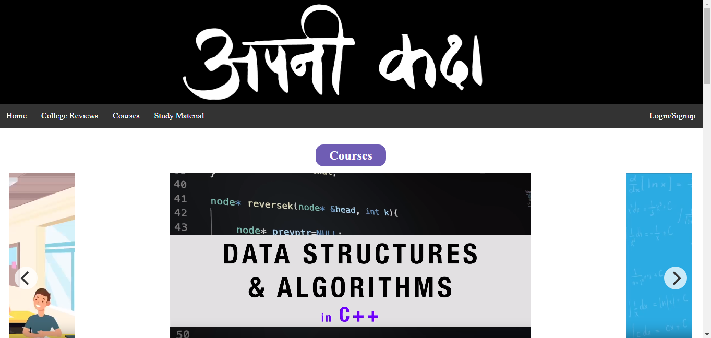

## Apni Kaksha Clone - A Replicated Educational Website

This repository contains a cloned version of the Apni Kaksha educational website. The project focuses on emulating the visual appearance and key functionalities of the original website using HTML and CSS. It provides users with a familiar interface to access educational content, courses, college reviews, study material, and information about the founder.

### Preview



### Features

- **Navigation Bar:** Replicates the navigation bar of the original Apni Kaksha website, providing links to different sections and interactive elements.

- **Courses Carousel:** Displays a carousel of course videos, similar to the original website's course section.

- **College Reviews:** Embedded YouTube videos offer a glimpse into college reviews, providing insights into different institutions and courses.

- **Study Material Carousel:** Presents study notes in a carousel format, allowing users to view and download PDF files.

- **Founder Information:** Provides details about the founder of Apni Kaksha, including a picture, social media links, and a brief biography.

- **Responsive Design:** The website adapts to various screen sizes, ensuring a consistent experience for users on different devices.

### How to Use

1. Clone the repository using the following command:
   ```sh
   git clone https://github.com/MuhammadAmmarAtique/EduWebClone
   ```

2. Open the `index.html` file in your web browser to explore the cloned Apni Kaksha website.

#### Dependencies

The project uses the following external resources:

- Flickity: Provides carousel functionality for course videos and study material.
- YouTube Embed: Embeds YouTube videos for college reviews.

### Contributing

This project is currently a personal endeavor and is not open to external contributions. However, if you have suggestions or improvements, you can fork the repository and create your own version.

### License

This project is intended for educational purposes and serves as a demonstration of HTML and CSS skills. It is not associated with the original Apni Kaksha website. All images, videos, and content from the original website are subject to their respective licenses.

